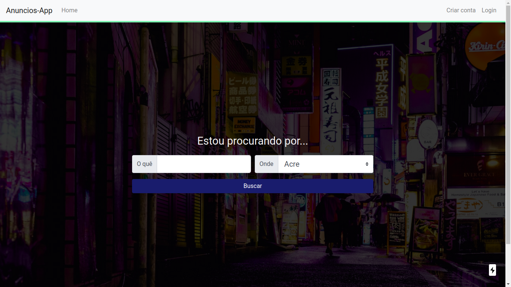
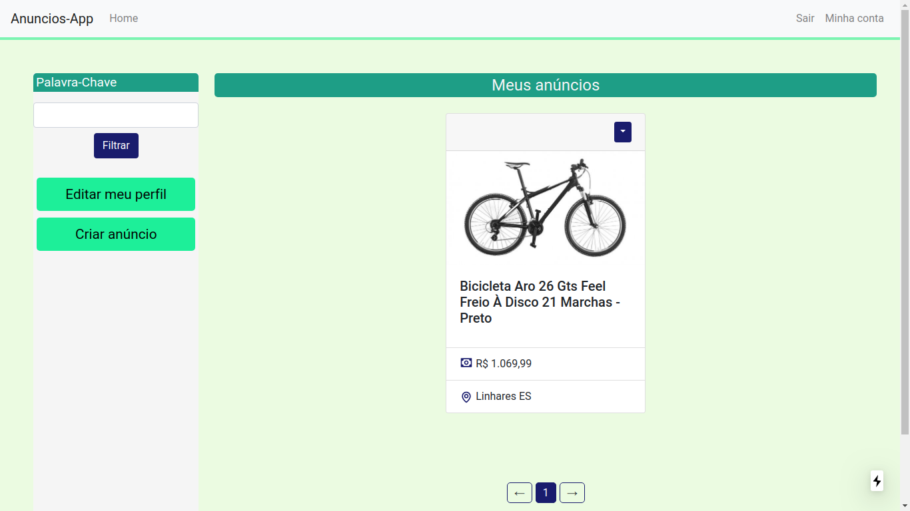
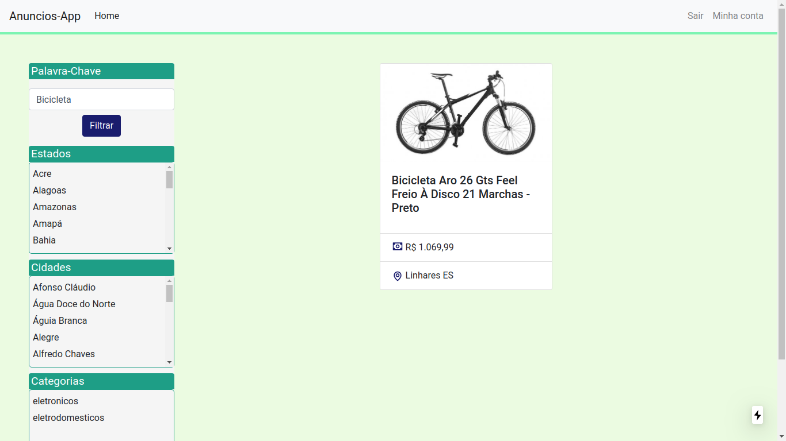

# Site de anúncios

Um site que permite que as pessoas postem anúncios na internet.

<p>
<br/>
<br/>

<br/>
<br/>

<br/>
<br/>

<br/>
<br/>
</p>


## Pré-requisitos
Antes de começar, você vai precisar ter instalado em sua máquina as seguintes ferramentas: [Docker](https://www.docker.com/), [Docker Compose](https://docs.docker.com/compose/install/).

## Como Usar

```bash
# Clone este repositório
$ git clone <https://github.com/hudsonfranca/AnunciosApp.git>

# Acesse a pasta do projeto no terminal/cmd
$ cd AnunciosApp

# Execute a aplicação em modo de desenvolvimento
$ docker-compose up  

# Para criar anúncios você precisa cadastrar uma categoria no banco de dados
$ curl -d '{"name":"eletronicos"}' -H "Content-Type: application/json" -X POST http://localhost:4000/category

# A aplicação inciará na porta:3000 - acesse <http://localhost:3000>

# Desative o Adblock porque ele pode causar alguma interferência na aplicação.
```

## 🛠 Tecnologias

As seguintes ferramentas foram usadas na construção do projeto:

- [Typescript](https://www.typescriptlang.org/)
- [Next.js](https://nextjs.org/)
- [Nestjs](https://nestjs.com/)
- [Nodejs](https://nodejs.org/en/)
- [Docker](https://www.docker.com/)
- [Docker Compose](https://docs.docker.com/compose/install/)
- [Postgresql](https://www.postgresql.org/)
- [React Bootstrap](https://react-bootstrap.github.io/)
- [Bootstrap](https://getbootstrap.com/)
- [Yarn](https://yarnpkg.com/)
- [styled-components](https://styled-components.com/)


